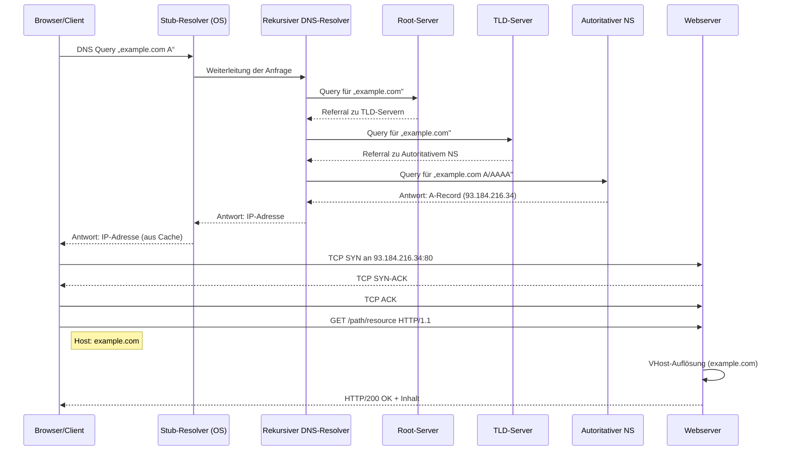
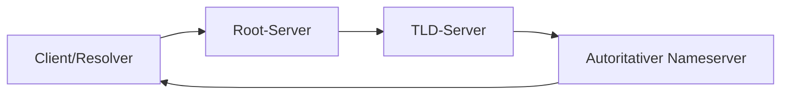

# DNS & Namensauflösung

Das Domain Name System (DNS) ist das grundlegende Namensverzeichnis des Internets, das Menschen die Nutzung von Webadressen erheblich vereinfacht. Anstatt sich komplexe Zahlenketten (IP-Adressen) merken zu müssen, geben Nutzer leicht verständliche, hierarchisch aufgebaute Domainnamen wie „beispiel.de“ ein. DNS übernimmt dann die Aufgabe, diese Namen automatisch in die zugehörigen IP-Adressen aufzulösen. Auf diese Weise kann jede Anwendung, die Netzwerkzugriff benötigt, den richtigen Server finden, ohne die dahinterliegende Adresse direkt zu kennen.

Darüber hinaus ermöglicht DNS eine effiziente Lastverteilung und Ausfallsicherheit: Große Dienste können hinter einem einzigen Domainnamen mehrere Server betreiben. DNS-Einträge verteilen Anfragen je nach geografischer Nähe oder aktueller Serverauslastung – so bleibt die Performance hoch und mögliche Ausfälle werden abgefedert. Gleichzeitig lassen sich unterschiedliche Dienste wie Web, E-Mail oder Sicherheitsrichtlinien über spezialisierte DNS-Eintragstypen (beispielsweise MX oder TXT) unter einer gemeinsamen Domain organisieren.

DNS ist außerdem dezentral und hierarchisch strukturiert. Dadurch müssen weder Anwender noch einzelne Organisationen eine globale Übersicht aller Namen pflegen. Stattdessen koordiniert ein abgestuftes System von Servern die Weiterleitung und Delegation der Namensanfragen. Diese Architektur gewährleistet, dass das System weltweit skaliert und Änderungen an Domainzuordnungen transparent umgesetzt werden können, ohne dass Nutzer ihrerseits etwas anpassen müssen.

Insgesamt trägt DNS wesentlich zur Benutzerfreundlichkeit, Flexibilität und Stabilität des Internets bei. Es verbirgt technische Komplexität, unterstützt verteilte Dienste und ermöglicht schnelle Anpassungen bei gleichzeitiger Sicherstellung der Erreichbarkeit und Performance.

**Warum DNS unverzichtbar ist:**  
- Verzicht auf das Merken von IP-Adressen durch menschenlesbare Domainnamen  
- Automatische Umleitung zu verfügbaren Servern für Ausfallsicherheit  
- Lastverteilung über mehrere Server unter einer Domain  
- Einfache Verwaltung verschiedener Dienste (Web, E-Mail, Sicherheit) über spezialisierte Einträge  
- Dezentrale, hierarchische Struktur für weltweite Skalierbarkeit  
- Transparente, sofort wirksame Änderungen ohne Nutzerintervention  
- Hohe Performance durch geografische und lastabhängige Auflösung  
- Grundlage für moderne Sicherheitsmechanismen (z. B. DNSSEC, SPF, DKIM)  

* **Auflösungskette**

  1. DNS-Resolver (lokaler oder ISP-Cache)
  2. Root-Server (.)
  3. TLD-Nameserver (.de, .com, …)
  4. Autoritativer Nameserver (für die Domäne)
* **Zweck des Vortrags:** Grundlagen klären, Neugier wecken

## Sequence Diagram



| Entity                              | Beschreibung                                                                                               |
|-------------------------------------|------------------------------------------------------------------------------------------------------------|
| Browser/Client                      | Sendet die DNS-Anfrage und die HTTP-Request-Nachricht sowie den Host-Header und empfängt die Antworten.     |
| Stub-Resolver (OS)                  | Leitet lokale DNS-Anfragen des Betriebssystems an einen konfigurierten rekursiven Resolver weiter.         |
| Rekursiver DNS-Resolver             | Führt iterativ die Auflösung durch, indem er Root-, TLD- und autoritative Nameserver abfragt.              |
| Root-Server                          | Startpunkt der DNS-Kaskade, verweist auf die zuständigen Server für die Top-Level-Domain.                  |
| TLD-Server                          | Verantwortlich für eine bestimmte Top-Level-Domain und verweist auf den autoritativen Nameserver der Domain. |
| Autoritativer NS                    | Hält die Zonendaten und liefert die finalen DNS-Resource-Records für die angefragte Domain.                |
| Webserver                           | Empfängt den HTTP-GET-Request, löst den Virtual Host anhand des Host-Headers auf und liefert die Ressource. |

## 2. DNS-Einträge

Das Domain Name System (DNS) verwaltet die Zuordnung zwischen menschenlesbaren Namen und maschinenlesbaren IP-Adressen. Jeder DNS-Eintrag beschreibt einen bestimmten Aspekt dieser Übersetzung oder zusätzliche Informationen zu einer Domain. Ein A-Record verbindet einen Hostnamen mit einer IPv4-Adresse, während ein AAAA-Record dieselbe Aufgabe für IPv6-Adressen übernimmt. CNAME-Einträge dienen als Aliasse und leiten eine Domain auf eine andere um, ohne direkt IP-Daten zu speichern. MX-Records definieren die zuständigen Mail-Server für den E-Mail-Versand einer Domain, und TXT-Einträge erlauben frei definierbare Textinformationen – häufig verwendet für Sicherheitsrichtlinien wie SPF, DKIM oder DMARC. SRV-Records spezifizieren Dienste und ihre zugrunde liegenden Server, etwa für VoIP oder Chat-Protokolle, und NS-Einträge geben an, welche Nameserver für eine gesamte DNS-Zone autoritativ sind. Darüber hinaus gibt es spezielle Einträge wie SOA (Start of Authority), der grundlegende Verwaltungsdaten einer Zone enthält, sowie DNSSEC-bezogene Records (DNSKEY, RRSIG, DS, NSEC/NSEC3) zur Gewährleistung der Integrität und Authentizität von DNS-Daten. Durch diese Vielfalt an Record-Typen ermöglicht DNS nicht nur die reine Namensauflösung, sondern bildet zugleich eine flexible Plattform für Lastverteilung, Sicherheitsmaßnahmen und Dienstkoordination im Internet.

```dns
;; ANSWER SECTION:
example.com.        3600    IN  A       93.184.216.34
example.com.        3600    IN  AAAA    2606:2800:220:1:248:1893:25c8:1946
example.com.        3600    IN  MX      10 mail.example.com.
example.com.        3600    IN  TXT     "v=spf1 include:_spf.example.com ~all"
example.com.        3600    IN  TXT     "google-site-verification=XYZ123abc"
example.com.        3600    IN  CAA     0 issue \"letsencrypt.org\"
www.example.com.    3600    IN  CNAME   example.com.
autoconfig.example.com. 3600 IN  A      93.184.216.200
_service._tcp.example.com. 3600 IN SRV  10 5 443 srv1.example.com.

;; AUTHORITY SECTION:
example.com.        172800  IN  NS      ns1.exampledns.com.
example.com.        172800  IN  NS      ns2.exampledns.com.
example.com.        172800  IN  SOA     ns1.exampledns.com. admin.example.com. 2025061701 7200 3600 1209600 3600

;; ADDITIONAL SECTION:
mail.example.com.   3600    IN  A       93.184.216.50
srv1.example.com.   3600    IN  A       93.184.216.55
ns1.exampledns.com. 172800  IN  A       203.0.113.53
ns2.exampledns.com. 172800  IN  A       198.51.100.77
```

**Detaillierte Erklärung der DNS-Antwort:**

| Name                    | TTL   | Class | Type  | Data                        |
|-------------------------|-------|-------|-------|-----------------------------|
| Domainname (z. B. example.com.) | Zeit bis zur nächsten Aktualisierung (Sekunden) | Netzwerkklasse (meist IN für Internet) | Record-Typ (A, AAAA, MX, etc.) | Inhalt des Records (z. B. IP-Adresse, Hostname, Text) |

* Name: Der Domainname, für den der Record gilt.
* TTL (Time to Live): Gibt an, wie lange die Information zwischengespeichert werden darf (in Sekunden).
* Class: Fast immer „IN“ (Internet), historisch gibt es weitere Klassen, die aber kaum verwendet werden.
* Type: Typ des DNS-Records (z. B. A, AAAA, MX, NS, CNAME, etc.).
* Data: Die eigentlichen Daten, z. B. IP-Adresse, Zielhost, Text, weitere Parameter je nach Record-Typ.

**ANSWER SECTION**
- `example.com.        3600    IN  A       93.184.216.34`  
  → Weist der Domain „example.com“ eine IPv4-Adresse zu.  
- `example.com.        3600    IN  AAAA    2606:2800:220:1:248:1893:25c8:1946`  
  → Weist der Domain „example.com“ eine IPv6-Adresse zu.  
- `example.com.        3600    IN  MX      10 mail.example.com.`  
  → Legt fest, dass E-Mails für „example.com“ an den Mailserver „mail.example.com“ (Priorität 10) zugestellt werden.  
- `example.com.        3600    IN  TXT     "v=spf1 include:_spf.example.com ~all"`  
  → Definiert einen SPF-Eintrag für E-Mail-Sicherheitsrichtlinien.  
- `example.com.        3600    IN  TXT     "google-site-verification=XYZ123abc"`  
  → Enthält einen Text für die Bestätigung der Domain bei Google.  
- `example.com.        3600    IN  CAA     0 issue "letsencrypt.org"`  
  → Legt fest, dass nur Let’s Encrypt für „example.com“ SSL-Zertifikate ausstellen darf.  
- `www.example.com.    3600    IN  CNAME   example.com.`  
  → Macht „www.example.com“ zu einem Alias für „example.com“.  
- `autoconfig.example.com. 3600 IN  A      93.184.216.200`  
  → Gibt eine eigene IPv4-Adresse für „autoconfig.example.com“ an (z. B. für Mail-Client-Autokonfiguration).  
- `_service._tcp.example.com. 3600 IN SRV  10 5 443 srv1.example.com.`  
  → Beschreibt einen Dienst (z. B. für VoIP oder Chat): Priorität 10, Gewicht 5, Port 443, Ziel „srv1.example.com“.

**AUTHORITY SECTION**
- `example.com.        172800  IN  NS      ns1.exampledns.com.`  
- `example.com.        172800  IN  NS      ns2.exampledns.com.`  
  → Listet die autoritativen Nameserver für „example.com“ auf.  
- `example.com.        172800  IN  SOA     ns1.exampledns.com. admin.example.com. 2025061701 7200 3600 1209600 3600`  
  → SOA-Eintrag (Start of Authority): Legt primären Nameserver, Kontakt-Mail, und technische Parameter der Zone fest.

**ADDITIONAL SECTION**
- `mail.example.com.   3600    IN  A       93.184.216.50`  
  → Liefert die IPv4-Adresse des Mailservers aus dem MX-Eintrag.  
- `srv1.example.com.   3600    IN  A       93.184.216.55`  
  → Gibt die IP-Adresse für den Server, der vom SRV-Record genutzt wird, an.  
- `ns1.exampledns.com. 172800  IN  A       203.0.113.53`  
- `ns2.exampledns.com. 172800  IN  A       198.51.100.77`  
  → Liefert die IP-Adressen der autoritativen Nameserver, damit sie direkt erreichbar sind.

**Zusammengefasst:**  
Die Nachricht enthält mehrere Record-Typen (A, AAAA, MX, TXT, CAA, CNAME, SRV, NS, SOA) und zeigt, wie DNS für Adressierung, Mailrouting, Dienstfindung, Zertifikatssicherheit und Domain-Management verwendet wird.

### A- und AAAA-Records

**A-Record (Address Record)**
Der A-Record ist einer der grundlegendsten und wichtigsten DNS-Record-Typen. Er verknüpft einen Hostnamen (wie `example.com`) mit einer eindeutigen IPv4-Adresse. Immer wenn ein Client eine IPv4-Verbindung zu einem Hostnamen herstellen möchte, fragt er den zuständigen DNS-Server nach dem entsprechenden A-Record. Die Rückgabe ist eine 32-Bit-IP-Adresse, z. B. `93.184.216.34`. Es können auch mehrere A-Records für einen Host existieren – das wird oft für Load Balancing oder Ausfallsicherheit genutzt.

**Beispiel:**
```dns
example.com.  3600  IN  A  93.184.216.34
````

**AAAA-Record (IPv6 Address Record)**
Der AAAA-Record („Quad-A-Record“) ist das IPv6-Pendant zum A-Record. Er ordnet einen Hostnamen einer 128-Bit-IPv6-Adresse zu, was die Kommunikation über das neue IP-Protokoll ermöglicht. Auch hier sind mehrere AAAA-Records für einen Host möglich, etwa zur Verteilung auf verschiedene Standorte oder Systeme.

**Beispiel:**

```dns
example.com.  3600  IN  AAAA  2606:2800:220:1:248:1893:25c8:1946
```

**Wichtige Merkmale und Hinweise:**

* Beide Records können für denselben Host parallel existieren; moderne Clients bevorzugen IPv6, wenn möglich.
* Ohne einen passenden A- oder AAAA-Record kann ein Hostname nicht in eine IP-Adresse übersetzt werden, die für die Netzwerkkonnektivität notwendig ist.
* Die TTL (Time to Live) bestimmt, wie lange der Record im Cache verbleiben darf (hier: 3600 Sekunden).
* Bei vielen Providern und Webdiensten ist es üblich, sowohl A- als auch AAAA-Records zu setzen, um IPv4- und IPv6-Erreichbarkeit zu gewährleisten.

**Zusammenfassung:**

* A-Record: Hostname → IPv4-Adresse
* AAAA-Record: Hostname → IPv6-Adresse
* Grundbaustein für jede Namensauflösung im Internet
* Mehrere Records möglich (Load Balancing, Redundanz)
* Notwendig für Erreichbarkeit über das jeweilige IP-Protokoll

### CNAME-Record (Canonical Name Record)

Der CNAME-Record (Canonical Name Record) ist ein spezieller DNS-Record-Typ, der einen Domainnamen als Alias für einen anderen Domainnamen definiert. Das bedeutet: Wird ein CNAME-Eintrag abgefragt, leitet der DNS-Server die Anfrage automatisch an den als Ziel angegebenen „kanonischen“ Namen weiter. So zeigt beispielsweise `www.example.com` per CNAME auf `example.com` und übernimmt dessen A-, AAAA- oder andere relevante Records.

Typischerweise werden CNAME-Records eingesetzt, um mehrere Subdomains oder alternative Domains einfach und zentral auf einen Hauptnamen zu zeigen. Das vereinfacht das Management, da nur der Zielname gepflegt werden muss – ändert sich dort die IP-Adresse, betrifft das automatisch auch alle Aliasse.

Wichtig: Ein CNAME darf nur als alleiniger Eintrag für einen Namen existieren, es dürfen keine anderen Records (z.B. A, MX) für denselben Host existieren.

**Beispiel:**
```dns
www.example.com.  3600  IN  CNAME  example.com.
```

Fragt nun ein Client die IP für `www.example.com` ab, erhält er vom DNS-Server einen Verweis auf `example.com` und muss die Anfrage erneut für diesen Namen stellen.

**Wichtige Merkmale und Hinweise:**

* Erlaubt die zentrale Steuerung von Aliassen (z.B. www, ftp, mail)
* Spart Verwaltungsaufwand und verhindert Inkonsistenzen
* CNAME und andere Record-Typen dürfen nicht für denselben Namen existieren
* Die eigentliche Adresse (A, AAAA etc.) wird vom Ziel des CNAME bezogen
* Besonders bei großen Webdiensten oder bei CDN-Integration verbreitet

**Zusammenfassung (Bullet Points):**

* CNAME steht für „Canonical Name Record“ (Alias)
* Weist einen Hostnamen auf einen anderen Namen um
* Zentralisiert das DNS-Management und erleichtert Änderungen
* Keine Koexistenz mit anderen Record-Typen für denselben Namen erlaubt
* Nützlich für Aliasnamen, Subdomains, CDNs, Cloud- und Hosting-Umgebungen


### MX-Record (Mail Exchanger Record)

Der MX-Record (Mail Exchanger Record) ist ein DNS-Record-Typ, der für den E-Mail-Verkehr einer Domain unerlässlich ist. Er legt fest, an welche(n) Mailserver E-Mails für eine bestimmte Domain zugestellt werden sollen. Jede Domain, die E-Mails empfangen möchte, benötigt mindestens einen gültigen MX-Record.

Ein MX-Record enthält neben dem Namen des Mailservers auch eine Prioritätsangabe (Präferenzwert). Je niedriger dieser Wert, desto bevorzugter wird der entsprechende Mailserver von sendenden E-Mail-Systemen kontaktiert. So können mehrere MX-Records mit unterschiedlicher Priorität angegeben werden, um Ausfallsicherheit zu gewährleisten: Ist der bevorzugte Server nicht erreichbar, wird der nächste in der Liste angefragt.

Der Hostname im MX-Record muss auf einen gültigen A- oder AAAA-Record zeigen, nicht auf einen CNAME.

**Beispiel:**
```dns
example.com.   3600  IN  MX   10 mail1.example.com.
example.com.   3600  IN  MX   20 mail2.example.com.
```

In diesem Beispiel ist `mail1.example.com` der bevorzugte Mailserver für E-Mails an `example.com`. Fällt dieser aus, übernimmt `mail2.example.com` als Backup.

**Wichtige Merkmale und Hinweise:**

* Dient ausschließlich der Steuerung des E-Mail-Empfangs für eine Domain
* Ermöglicht Ausfallsicherheit durch mehrere MX-Records mit verschiedener Priorität
* Der Eintrag verweist immer auf einen Hostnamen mit A/AAAA-Record, nicht auf einen CNAME
* Auch Subdomains können eigene MX-Records besitzen
* Unverzichtbar für jede Domain, die E-Mails empfangen soll

**Zusammenfassung:**

* MX steht für „Mail Exchanger“ (Mailserver für eingehende E-Mails)
* Prioritätswert bestimmt die Reihenfolge, in der Mailserver kontaktiert werden
* Ermöglicht Redundanz und Ausfallsicherheit für den E-Mail-Empfang
* MX verweist auf Hostnamen mit gültigem A/AAAA-Record
* Unerlässlich für Domains mit eigenem E-Mail-Service


### TXT-Record (Text Record)

Der TXT-Record ist ein vielseitiger DNS-Record-Typ, der beliebige, von Menschen oder Maschinen lesbare Textinformationen zu einer Domain speichern kann. TXT-Records wurden ursprünglich entwickelt, um frei definierbare Notizen oder technische Hinweise in die DNS-Zone einzutragen. Mit der Zeit haben sie jedoch zahlreiche sicherheitsrelevante und infrastrukturelle Aufgaben übernommen.

Heutzutage sind TXT-Records vor allem für E-Mail-Authentifizierung und -Sicherheit unverzichtbar. Sie dienen zum Beispiel als Transport für SPF- (Sender Policy Framework), DKIM- (DomainKeys Identified Mail) und DMARC- (Domain-based Message Authentication, Reporting & Conformance) Richtlinien. Diese Mechanismen helfen, Spam und Phishing zu verhindern und die Authentizität von E-Mails sicherzustellen. Auch andere Dienste wie Google Search Console oder Microsoft 365 nutzen TXT-Records zur Domain-Verifizierung.

Ein TXT-Record kann mehrere Textstrings enthalten und eine Domain kann mehrere TXT-Records besitzen. Die Einträge selbst haben keine technische Funktion außer der Veröffentlichung des Inhalts – sie werden von Clients, Mailservern oder Diensten ausgewertet.

**Beispiel:**
```dns
example.com.  600  IN  TXT  "v=spf1 include:_spf.example.com ~all"
example.com.  600  IN  TXT  "google-site-verification=xyz123"
```

**Wichtige Merkmale und Hinweise:**

* Speicherung beliebiger textbasierter Informationen im DNS
* Unverzichtbar für E-Mail-Sicherheitsmechanismen wie SPF, DKIM und DMARC
* Häufig für Domain-Besitznachweis und Integrationsnachweise bei Cloud-Diensten genutzt
* Mehrere TXT-Records pro Domain möglich
* Werden von verschiedenen Anwendungen und Diensten ausgewertet

**Zusammenfassung:**

* TXT steht für „Text Record“ (Text-Eintrag im DNS)
* Speichert beliebige Informationen als Text
* Zentral für E-Mail-Sicherheit und Domain-Authentifizierung
* Dient auch für technische Hinweise, Integrations- und Verifizierungszwecke
* Keine direkte technische Funktion im DNS – Interpretation durch externe Dienste


### Alle Record-Types

| Record-Typ | Zweck / Beschreibung                                                    |
|------------|-------------------------------------------------------------------------|
| A          | Ordnet einen Hostnamen einer IPv4-Adresse zu                            |
| AAAA       | Ordnet einen Hostnamen einer IPv6-Adresse zu                            |
| CNAME      | Alias für einen anderen Domainnamen                                     |
| MX         | Definiert Mail-Exchanger für E-Mail-Zustellung                          |
| NS         | Gibt autoritative Nameserver für eine Zone an                           |
| SOA        | Start of Authority: Grundlegende Verwaltungsinformationen einer Zone     |
| PTR        | Reverse-DNS: Ordnet IP-Adressen Hostnamen zu                            |
| TXT        | Speichert beliebige Textinformationen (z. B. SPF, DKIM, DMARC)           |
| SRV        | Definiert Dienste und ihre Server (z. B. SIP, XMPP)                     |
| CAA        | Certification Authority Authorization: Legt fest, welche CAs Zertifikate ausstellen dürfen |
| DNSKEY     | Enthält öffentliche Schlüssel für DNSSEC                                 |
| RRSIG      | Signiert DNS Resource Records für DNSSEC                                |
| DS         | Delegation Signer: Zeigt auf DNSKEY des untergeordneten Nameservers     |
| NSEC       | Authentifiziert Nicht-Existenz von DNS-Einträgen (DNSSEC)               |
| NSEC3      | Verbesserte Version von NSEC zur Verschleierung von Zoneninhalten       |
| TLSA       | Verknüpft TLS-Zertifikate mit Services (DANE)                           |
| SPF        | (veraltet) Enthält Sender Policy Framework-Daten für E-Mail            |


Hier ist eine ausführlichere Section „Verteilte Auflösung“ für deinen README:

## 3. Verteilte Auflösung

Das Domain Name System ist hierarchisch und verteilt aufgebaut, um sowohl Skalierbarkeit als auch Ausfallsicherheit zu gewährleisten. Die Namensauflösung erfolgt in mehreren Schritten, bei denen verschiedene spezialisierte Servertypen kooperieren:



**Ablauf der verteilten DNS-Auflösung:**

1. **Root-Server:**
   Die Root-Server sind der oberste Einstiegspunkt des DNS. Sie kennen die Adressen aller Nameserver für sämtliche Top-Level-Domains (TLDs) wie `.com`, `.de`, `.org` usw. Ein Resolver, der einen Domainnamen nicht im Cache findet, fragt zuerst einen der weltweit verteilten Root-Server. Die Root-Server antworten nicht mit der IP-Adresse der gewünschten Domain, sondern geben einen Verweis (Referral) auf die zuständigen TLD-Server zurück.

2. **TLD-Server:**
   Jeder TLD-Server ist für eine bestimmte Top-Level-Domain verantwortlich. Beispielsweise kennt der `.de`-Server alle autoritativen Nameserver für Domains wie `example.de`. Nach dem Hinweis der Root-Server sendet der Resolver eine Anfrage an den passenden TLD-Server. Auch hier erhält er keinen direkten A- oder AAAA-Record, sondern einen Referral auf den autoritativen Nameserver der gewünschten Second-Level-Domain.

3. **Autoritativer Nameserver:**
   Dieser Server ist die maßgebliche Instanz für die angefragte Domain. Er hält die eigentlichen DNS-Records (z. B. A, AAAA, MX, TXT) und liefert die finale Antwort an den Resolver zurück. Erst hier erhält der Client die benötigte Information, etwa die IP-Adresse des Webservers.

4. **Zonendelegation:**
   Damit DNS weltweit und dezentral funktioniert, ist der Namensraum in Zonen unterteilt. Jede Zone wird von autoritativen Nameservern verwaltet und kann für untergeordnete Zonen (Subdomains) die Verantwortung weiter delegieren. Diese Zonendelegation sorgt dafür, dass die Zuständigkeiten klar geregelt sind und Änderungen gezielt in einzelnen Zonen vorgenommen werden können.

**Zusammengefasst:**

* Die Auflösung von Domainnamen erfolgt stets in mehreren Stufen („Verweise nach unten“).
* Jeder Server in der Kette kennt nur seinen Verantwortungsbereich und verweist ansonsten an die nächstzuständige Instanz.
* Das System ist robust, skalierbar und ermöglicht es Millionen von Domains weltweit eindeutig und effizient zu verwalten.


## 4. Tools & Praxis

### `dig`

`dig` ("Domain Information Groper") ist das Standardwerkzeug zur Analyse und Fehlersuche bei DNS-Problemen. Es wird verwendet, wenn man wissen will:
- Welche IP-Adresse aktuell für eine Domain eingetragen ist
- Welche Mailserver (MX), Aliasse (CNAME) oder Textinformationen (TXT) für eine Domain gelten
- Ob Änderungen am DNS schon überall angekommen sind (TTL, Caching)
- Wie die gesamte Auflösungskette im DNS abläuft (`+trace`)

Das Tool ist unverzichtbar für Netzwerkadministratoren, Entwickler, IT-Support und jeden, der DNS-Fehler analysieren oder DNS-Einträge prüfen will.

### Was kann ich mit `dig` machen? (Praxisbeispiele)

**1. Abfrage der IPv4-Adresse (A-Record):**
```bash
dig example.com A
````

Zeigt, auf welche IPv4-Adresse die Domain zeigt.

**2. IPv6-Adresse abfragen (AAAA-Record):**

```bash
dig example.com AAAA
```

**3. MX-Records anzeigen (Mailserver):**

```bash
dig example.com MX
```

**4. CNAME und Alias-Weiterleitungen prüfen:**

```bash
dig www.example.com CNAME
```

**5. TXT-Records anzeigen (SPF, DMARC etc.):**

```bash
dig example.com TXT
```

**6. Nur die eigentliche Antwort ohne Zusatzinfos:**

```bash
dig +short example.com
```

**7. Die gesamte Auflösungskette ("trace") sichtbar machen:**

```bash
dig +trace example.com
```

Zeigt Schritt für Schritt, welche Server befragt werden (Root → TLD → Authoritative).

**8. Einen bestimmten DNS-Server anfragen:**

```bash
dig @1.1.1.1 example.com
```

Fragt gezielt den Resolver 1.1.1.1 (Cloudflare) statt den voreingestellten DNS-Server ab.

**9. Mehrere Records auf einmal abfragen:**

```bash
dig example.com ANY
```

Achtung: Nicht alle Server antworten auf ANY-Anfragen umfassend, aber oft sieht man viele Records gesammelt.

---


### `nslookup`

`nslookup` ist ein verbreitetes Werkzeug zur schnellen Überprüfung von DNS-Einträgen direkt von der Kommandozeile. Es eignet sich besonders, wenn du:
- DNS-Probleme einfach und schnell diagnostizieren willst
- einzelne DNS-Einträge abfragen oder Fehlerquellen eingrenzen möchtest
- herausfinden willst, welche IP-Adressen oder Server aktuell hinter einer Domain stehen
- gezielt bestimmte DNS-Server abfragen möchtest (z.B. eigenen Resolver oder öffentlichen Dienst wie 8.8.8.8)

Das Tool ist auf nahezu jedem System vorinstalliert (Windows, Linux, macOS) und besonders für gelegentliche Prüfungen und interaktive Tests nützlich.

### Was kann ich mit `nslookup` machen? (Praxisbeispiele)

**1. Einfache Abfrage eines A-Records (IPv4-Adresse):**
```bash
nslookup example.com
````

Zeigt die zugehörige IPv4-Adresse der Domain an.

**2. Einen bestimmten Record-Typ abfragen (z.B. MX):**

```bash
nslookup -type=MX example.com
```

Listet alle Mailserver (MX-Records) der Domain auf.

**3. Einen anderen DNS-Server gezielt nutzen:**

```bash
nslookup example.com 8.8.8.8
```

Fragt die Auflösung direkt beim Google DNS-Server (8.8.8.8) ab.

**4. Interaktive Nutzung (z.B. zum Wechseln des Record-Typs oder Servers):**

```bash
nslookup
> set type=TXT
> example.com
> set type=AAAA
> example.com
> server 1.1.1.1
> example.com
```

Im interaktiven Modus kann man flexibel Record-Typen und Zielserver wechseln, ohne nslookup jedes Mal neu zu starten.

**5. Informationen zu Nameservern einer Domain abrufen:**

```bash
nslookup -type=NS example.com
```

---

Mit `nslookup` lassen sich schnell und unkompliziert DNS-Einträge abfragen, verschiedene Server testen und Fehlerquellen eingrenzen.


### systemd-resolved

`systemd-resolved` ist der Standard-Dienst zur Namensauflösung auf vielen modernen Linux-Systemen (z. B. Ubuntu, Fedora). Er übernimmt die Verwaltung von DNS-Anfragen, leitet sie an die richtigen DNS-Server weiter und speichert Antworten temporär im Cache. Das bringt mehrere Vorteile:

- **Caching**: Wiederholte Anfragen nach derselben Domain werden schneller beantwortet, da die Antwort zwischengespeichert wird.
- **Fallback & Mehrfachkonfiguration**: `systemd-resolved` kann mehrere DNS-Server parallel verwalten und intelligente Fallbacks nutzen.
- **Einfache Kontrolle & Debugging**: Mit dem Tool `resolvectl` (bzw. `systemd-resolve` auf älteren Systemen) kann der aktuelle Zustand eingesehen und gezielt nach Domains gesucht werden.

**Praxisbeispiele:**
```bash
# Status und Konfiguration anzeigen
resolvectl status

# Namensauflösung und Caching prüfen
resolvectl query example.com
```

Mit diesen Befehlen lässt sich prüfen, welche Server zur Namensauflösung genutzt werden, ob der Cache greift und wie schnell die Antwortzeiten sind.

---

### Hosts-Datei (`/etc/hosts`)

Die Datei `/etc/hosts` ist eine lokale Datenbank auf jedem Unix- oder Linux-System. Sie dient dazu, bestimmten Hostnamen fest definierte IP-Adressen zuzuordnen – völlig unabhängig von externen DNS-Servern. Einträge in dieser Datei werden **immer bevorzugt** ausgewertet, bevor DNS-Anfragen gestellt werden.

**Typischer Aufbau:**

```
127.0.0.1   localhost
192.168.0.50   meinserver.local
93.184.216.34  example.com
```

**Einsatzmöglichkeiten:**

* Umleitungen zu lokalen Testsystemen (z. B. für Webentwicklung)
* Schnelle Blockade bestimmter Domains (z. B. Werbefilter)
* Notfallmaßnahmen bei DNS-Ausfällen

**Hinweis:**
Einträge in `/etc/hosts` gelten nur auf dem lokalen System und müssen auf jedem Client einzeln gepflegt werden.

### Einrichten von Online DNS-Records
Live Demo
* Namecheap
* freedomain.one

---
